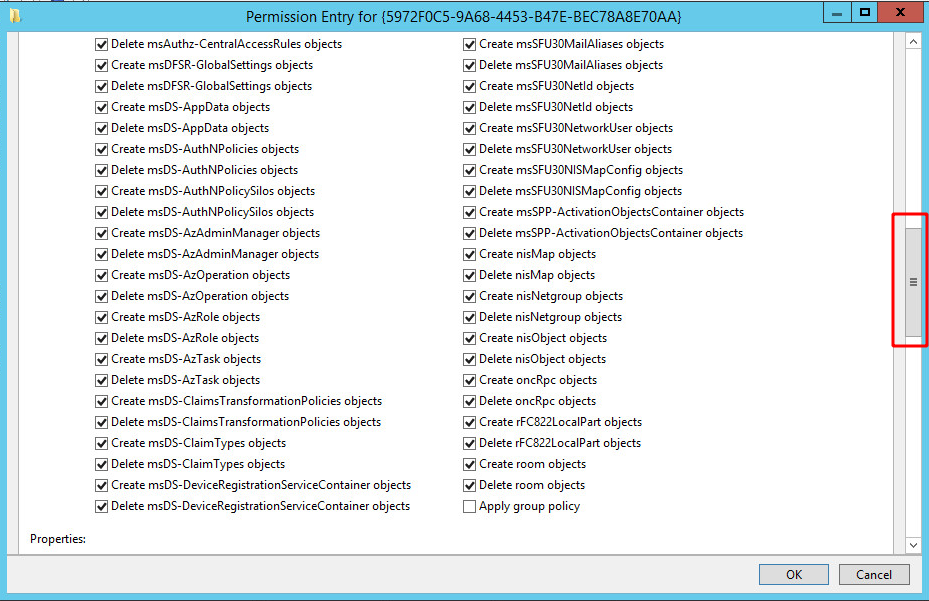

BloodHound est un outil permettant de cartographier un environnement Active Directory en le représentant sous forme de graphe. Cette représentation offre alors toute la puissance de la théorie des graphes pour découvrir des chemins d'attaque qui auraient été autrement difficiles voire impossibles à détecter.

<!--more-->

## Active Directory

En environnement Active Directory, la gestion des droits est complexe, très complexe. Il n'est pas rare qu'un utilisateur fasse partie d'un groupe, qui fait partie de 10 groupes, et que l'un des groupes ait le droit de modifier une GPO qui s'applique à une OU, dans laquelle se trouve des utilisateurs avec des droits d'administration sur un groupe de machines, etc. On pourrait trouver des déclinaisons de droits à l'infini.

Le soucis, c'est qu'en tant qu'administrateur d'un système d'information complexe, ces délégations de droits sont extrêmement complexes à détecter. En effet, l'administrateur regarde les listes de droits qu'a un utilisateur ou un groupe sur un objet en particulier. Il existe parfois plusieurs dizaines de droits différents qui peuvent être appliqués sur un objet.

Voici un exemple d'une liste d'ACE (Access Control Entry) que l'on peut trouver sur un objet "GPO".

[](../assets/uploads/2019/07/acl_complexity.png)

La barre de défilement à droite montre que le nombre d'entrées possibles est très important. Imaginez alors qu'il y a des entrées comme celles-ci sur tous les objets de l'Active Directory, que certains droits peuvent s'appliquer via délégation, qu'il y a des groupes inclus dans d'autres groupes, héritant des droits des groupes parents, etc.

C'est là qu'entre en jeu l'outil [BloodHound](https://github.com/BloodHoundAD/BloodHound). Quand la vision en mode liste des droits est un calvaire, la vision en mode graphe apporte quant à elle une clarté et un recul extrêmement valorisants.

## BloodHound

BloodHound est un outil développé par [@wald0](https://twitter.com/_wald0), [@Harmj0y](https://twitter.com/harmj0y) et [@CptJesus](https://twitter.com/cptjesus), dont j'ai parlé dans l'article sur les [GPO](/gpo-abuse-with-edit-settings/). L'idée de cet outil est d'analyser un environnement Active Directory en énumérant les différents objets de l'environnement, et en les liant avec des relations. Par exemple, si un utilisateur `support-account` est membre du groupe `support`, l'utilisateur sera lié par la relation `MemberOf` au groupe.

[](/assets/uploads/2019/07/MemberOf.png)

C'est une visualisation assez claire d'une appartenance, mais l'outil ne s'arrête pas là. Il permet de voir également que le groupe `support` fait partie du groupe `DOMAIN ADMINS`, donc par héritage, le compte `support` est un administrateur de domaine.

[](/assets/uploads/2019/07/memberOfNested.png)

Et en fait, ce n'est pas tout, si on demande de lister l'ensemble des groupes auxquels appartient `support`, on se rend compte qu'il appartient finalement à beaucoup d'autres groupes !

[](/assets/uploads/2019/07/MemberOfDelegated.png)

Bien entendu, il existe bien d'autres "relations" entre les objets. A l'heure de cet article, voici la liste des relations disponibles.

[](/assets/uploads/2019/07/edges.png)

On notera par exemple `AdminTo`, `HasSession`, `GenericAll` ou encore `AddAllowedToAct`.

Nous avons donc un ensemble d'objets liés entre eux par des relations. Il est alors possible de trouver des chemins en utilisant la théorie des graphes.

## Théorie des graphes

La [théorie de graphes](https://fr.wikipedia.org/wiki/Th%C3%A9orie_des_graphes) s'appuie sur une représentation "graphe" des données. C'est un modèle constitué de noeuds (ici les objets de l'Active Directory) et d'arêtes (ici les relations entre les objets). 

[](/assets/uploads/2019/07/graphe_example.png)

Les arêtes peuvent être orientées ou non. Dans le cas de BloodHound, elles le sont toujours. Cela signifie que pour aller d'un noeud A à un noeud B, il faut qu'ils soient reliés par une arête allant de A vers B. L'autre sens ne fonctionne pas.

[](/assets/uploads/2019/07/oriented_edge.png)

Une fois que nous avons ces noeuds reliés par des arêtes, nous pouvons chercher des chemins particuliers pour partir d'un noeud de départ et arriver à un noeud de destination, en passant par tout un ensemble de noeuds. Il existe souvent plusieurs chemins possibles, et la théorie des graphes permet de trouver les chemins les plus courts pour relier deux points particuliers.

Ainsi, le graphe suivant est constitué de 7 noeuds et 9 arêtes.

[](/assets/uploads/2019/07/graphe_before.png)

Si nous avons réussi à prendre la main sur le noeud le plus à gauche, et que nous souhaitons atteindre le noeud le plus à droite, car c'est le noeud `Administrateur de domaine`, la théorie des graphes permet de trouver le chemin le plus court entre les deux.

[](/assets/uploads/2019/07/graphe_after.png)

Un attaquant ayant cette information saura comment se déplacer dans le réseau pour atteindre son objectif en un minimum d'étapes.

Prenons comme exemple un environnement Active Directory. Il est composé d'un grand nombre de noeuds.

[](/assets/uploads/2019/07/all_nodes.png)

Si nous compromettons l'utilisateur `JDOE`, voici le chemin le plus court pour atteindre le groupe `DOMAIN ADMINS`.

[](/assets/uploads/2019/07/ad_shortest_path.png)

Comme on peut le voir, le chemin "le plus court" est finalement long, ce qui laisse présager une grande complexité des droits dans ce système d'information. Utiliser BloodHound permet, malgré cette complexité, d'extraire simplement et clairement un chemin d'attaque depuis un utilisateur qui à priori n'avait pas de droits particuliers.

Pour pouvoir traiter ces informations en mode graphe, BloodHound utilise la base de données "Neo4j", orientée graphe pour stocker les informations récoltées.

## Fonctionnement

L'outil BloodHound manipule plusieurs données, récoltées par différentes techniques. 

D'abord, afin de récolter les informations relatives à l'annuaire, il est nécessaire de les demander à un contrôleur de domaine. En effet, si nous sommes en possession d'un compte de domaine, même s'il n'a aucun droit particuliers, nous pouvons parcourir l'ensemble des utilisateurs, des machines, des GPO, lire les ACL, et d'autres informations. 

Par ailleurs, jusqu'à récemment, il était possible de demander aux différentes machines la liste de leurs groupes locaux, ce qui permettait de savoir qui était administrateur local de quelle machine en corrélant cette information avec l'appartenance des utilisateurs aux différents groupes.

Ensuite, nous sommes en mesure d'énumérer les sessions distantes sur les machines via la commande `net session \\computer`. Un exemple de sortie de cette commande est la suivante :

```
net session \\computer

Computer      User name                Client type  Opens   Idle time
---------------------------------------------------------------------
\\SOURCE      SUPPORT-ACCOUNT          Windows 7    1       00:00:13
```
Cette commande permet de savoir que l'utilisateur `SUPPORT-ACCOUNT` a demandé une ressource sur `computer` depuis le host `SOURCE`. Cette information permet d'affirmer que `SUPPORT-ACCOUNT` a en ce moment une session active sur `SOURCE`. C'est une information importante puisqu'elle indique que le secret d'authentification de `support-account` est présent dans la mémoire de **lsass** sur la machine `SOURCE`.

Ces différentes informations (non exhaustives) sont récoltées via le collecteur [SharpHound](https://github.com/BloodHoundAD/SharpHound), et sont enregistrées sous un format `json` dans différents fichiers.

[](/assets/uploads/2019/07/list_files.png)

Ces fichiers sont ensuite importés dans BloodHound qui les stocke dans la base de données Neo4j. Une fois l'import terminé, l'interface graphique BloodHound permet de visualiser rapidement ces données via des requêtes préparées ou des requêtes personnalisées.

[](/assets/uploads/2019/07/prebuilt_queries.png)

Il est également possible de directement envoyer les requêtes dans l'interface de Neo4j, ce qui peut être utile pour extraire des données sous forme de tableau, par exemple.

[](/assets/uploads/2019/07/neo4j_interface.png)

## Requêtes

Au dela des requêtes proposées par BloodHound, il est possible d'écrire ses propres requêtes. Je ne vais pas écrire ici un tutoriel à ce sujet, pour la raison suivante : [CptJesus](https://twitter.com/cptjesus) a écrit l'article [BloodHound: Intro to Cypher](https://blog.cptjesus.com/posts/introtocypher) dans lequel il décrit en détail le fonctionnement des requêtes dans BloodHound et dans Neo4j. Elles sont appelées "Cypher Queries".


Vous pouvez également aller lire le papier de [SadProcessor](https://twitter.com/SadProcessor) appelé [The Dog Whisperer's Handbook](https://www.ernw.de/download/BloodHoundWorkshop/ERNW_DogWhispererHandbook.pdf) qui présente BloodHound et introduit le langage de requête.

Je vous laisse ainsi le soin d'aller lire ces articles afin de comprendre le fonctionnement de ce langage.

Sachez cependant qu'il est possible d'activer le mode "debug" dans BloodHound permettant d'afficher les requêtes effectuées lorsque vous cliquez sur un bouton dans l'interface graphique.

[](/assets/uploads/2019/07/debug_mode.png)

Cette requête peut ensuite être rejouée dans Neo4j si besoin.

Pour tout de même montrer un exemple de requête, voici à quoi ça ressemble :

```
MATCH p=(n:User {name:"SUPPORT-ACCOUNT@ADSEC.LOCAL"})-[r:MemberOf*1..]->(g:Group) RETURN p
```

Cette requête permet de lister la hiérarchie des groupes auxquels appartient l'utilisateur `support-account`. Pour cela, elle peut être découpée en 2 parties.

La première partie `MATCH` indique ce que l'on recherche. Ce qu'on trouve entre parenthèse indique les noeuds, et entre crochets les relations.

Nous cherchons donc un noeud `n` de type `User` ayant une relation `r` de type `MemberOf` vers un noeud `g` de type `Group`. Le contenu entre accolades permet d'appliquer un filtre, ici un filtre sur le nom `SUPPORT-ACCOUNT@ADSEC.LOCAL`.

Dans la partie relation entre crochets, nous indiquons que cette relation doit être présente une ou plusieurs fois (`*1..`).

La deuxième partie `RETURN` indique ce que nous souhaitons retourner suite à la recheche. Ici, nous souhaitons retourner la relation dans son ensemble, que nous avons assignée à la variable `p`.

[](/assets/uploads/2019/07/query_result.png)

Nous aurions pu décider de seulement lister les groupes, sans lister les relations. Pour cela, il suffit de seulement retourner les noeuds `g`.

[](/assets/uploads/2019/07/query_result_g.png)

Pour des requêtes plus complexes, les liens donnés précédemment vous permettront de creuser le sujet.

## Tips & tricks

Voici une liste de quelques petites astuces ou informations qui peuvent être importantes ou utiles.

### Dark mode

La première, et de loin la plus importante, c'est le mode sombre de l'interface graphique !

[](/assets/uploads/2019/07/dark_mode.png)

Ce mode permet d'avoir une interface sombre et classe, ce qui est super agréable. Voilà, c'est beau, mais c'est tout.

### Clic droit

Lorsqu'il y a une relation entre deux noeuds, vous pouvez faire un "clic droit" sur la relation, et une pop-up vous affichera un grand nombre d'informations extrêmement utiles.

Vous ne savez pas comment exploiter le lien `GenericAll` ?

[](/assets/uploads/2019/07/genericall_link.png)

Pas de problème, un clic droit sur le lien permet d'afficher la bulle d'aide.

[](/assets/uploads/2019/07/help_modal.png)

Elle contient toutes les informations nécessaires pour prendre la main sur la machine de destination.

### Owned

Lors de l'avancement de votre test d'intrusion, vous allez compromettre des machines, des utilisateurs, des groupes. Afin de ne pas perdre le fil, vous pouvez marquer les objets comme "owned" après un clic droit sur ceux-ci.

[](/assets/uploads/2019/07/owned.png)

Une icône marquera ces objets par la suite.

[](/assets/uploads/2019/07/owned_object.png)

Si vous tentez de compromettre un objet en particulier, vous pouvez maintenant demander le chemin d'attaque le plus court depuis vos cibles déjà compromises.

[](/assets/uploads/2019/07/shortestpath_owned.png)

### Filtres

Si vous ne voulez pas afficher certains chemins parce qu'il y a des relations que vous ne savez pas exploiter, ou parce que vous n'avez pas le temps, ou toutes autres raisons, vous pouvez décider de décocher les relations pour qu'elles n'apparaissent plus dans vos requêtes. Pour cela, il suffit de cliquer sur le bouton de filtre, à droite de la barre de recherche, et de cocher et décocher les éléments qui vous intéressent.

[](/assets/uploads/2019/07/edge_filtering.png)

### Raccourcis

Il existe quelques raccourcis qui peuvent être utiles lors de l'utilisation de BloodHound. Si vous en connaissez d'autres, n'hésitez pas à les partager.

* **CTRL** : Permet de changer le mode d'affichage du nom des noeuds. En appuyant sur la touche, soit vous afficherez toujours les noeuds, soit vous les afficherez lorsqu'il n'y en a pas trop (la limite peut être définie dans les réglages), soit vous les cachez en permanence, ce qui peut être utile pour anonymiser les captures d'écran.
* **CTRL+SHIFT+I** : Affiche les outils développeurs. Si vous avez un bug dans l'interface, la console javascript permettra souvent de comprendre l'origine du problème.
* **CTRL+R** : Recharge l'affichage.

### Edition

Lors de la collecte, votre machine a été collectée et vous ne souhaitez pas la voir apparaitre ? Vous vous êtes connecté sur une machine, mais le lien "HasSession" de l'administrateur de domaine n'est plus effectif puisque cette machine a redémarré, effaçant les identifiants tant attendus ? Au contraire, un autre utilisateur s'est connecté sur cette machine ?

Une fois que les données ont été importées dans BloodHound, elles ne sont pas figées. Vous pouvez les modifier à votre guise, soit via un clic droit sur un objet ou une relation pour les supprimer, soit via un clic droit dans l'arrière plan pour ajouter un noeud ou une relation.

[](/assets/uploads/2019/07/add_edge.png)

### Notes & Captures d'écran

De la même manière, vous pouvez sauvegarder des informations sur des objets de l'Active Directory en cliquant sur ceux-ci et en allant dans la section "Notes" dans l'interface de BloodHound.

[](/assets/uploads/2019/07/notes_pictures.png)

### BloodHound Analytics

Enfin, la même équipe qui a développé BloodHound a également mis à disposition des outils permettant de faire des statistiques sur une extraction BloodHound. Ils sont disponibles sur [leur Github](https://github.com/BloodHoundAD/BloodHound-Tools/), notamment le template `bloodhoundanalytics.pbix` qui utilise `PowerBI`.

Voici un exemple pris du [tweet](https://twitter.com/_wald0/status/1139672785389703168) de Wald0, qui montre un tableau PowerBI en utilisant le template fourni sur le Github.

[](/assets/uploads/2019/07/PowerBi_result.png)

Le résultat est superbe, et très explicite pour le management.

## Aller plus loin

Une [présentation](https://www.youtube.com/watch?v=lxd2rerVsLo) a été faite à la BSides par les trois auteurs en 2016 pour présenter BloodHound. 

Les auteurs de l'outil sont également présents sur le [Slack](http://bloodhoundhq.slack.com/) dédié. Il y a une grande communauté présente sur ce Slack prête à vous accueillir et à répondre à vos questions. Il y a même un channel #french !

BloodHound n'est pas le seul outil dans son genre. Nous avons un outil franco-français appelé [AD Control Paths](https://github.com/ANSSI-FR/AD-control-paths) développé par l'ANSSI. Une [présentation](https://www.sstic.org/2014/presentation/chemins_de_controle_active_directory/) a été faite au SSTIC à ce sujet et le PDF associé est très intéressant. Je vous invite vivement à la lire.

## Conclusion

Tant que les équipes de défense réfléchiront en mode liste et les attaquants en mode graphe, ces derniers auront une longueur d'avance. C'est pourquoi **BloodHound** peut également être utilisé en tant qu'outil de défense. Il suffit de lancer une collecte d'information régulièrement et de préparer quelques requêtes pour vérifier l'état de l'Active Directory et pour monitorer son évolution.

BloodHound présente finalement une nouvelle approche pour visualiser les données dans un environnement Active Directory. La modélisation en mode graphe permet de comprendre les relations et intrications complexes des objets et relations dans le système d'information, pour en ressortir des chemins d'attaque ou des comportement anormaux.